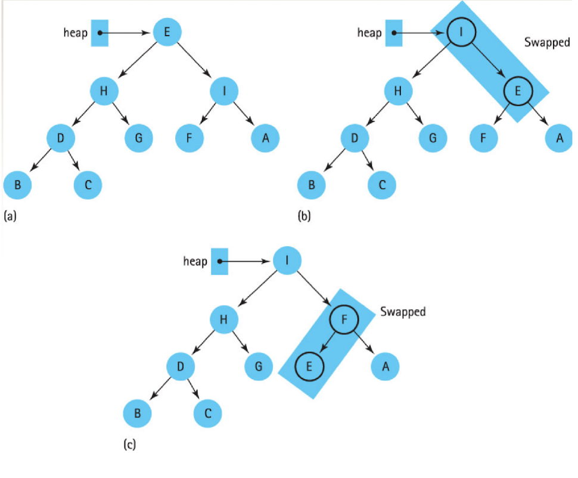

# Recursion
```
A function calls itself in order to divide work into smaller portions

1) base case:               when the program stops
2) general case:            how should the program calls itself
3) recursive algorithm:     an algorithm described in terms of base cases and general cases
```
### Ex). Factorial Code
```
recursive definition:
---------------------
> n! = 1 if n = 0;
> n! = n * (n-1)! if n > 0
-> 4! = 4*3! = 4*3*2! = 4*3*2*1! = 4*3*2*1*0! = 4*3*2*1*1 = 24
```
**code**
```
// Iterative solution 
int Factorial(int number) {
    int fact = 1;
    for (int count = 2; count <= number; count ++) {
        fact = fact * count;
    }
    return fact;
}

// Recursive solution 
int Factorial(int number) {
    if (number == 0)            // Base Case
    {
        return 1;
    }
    else                        // General Case 
    {
        return number * Factorial(number-1);
    }
}
```
*1) iterative solution uses a looping construct (for loop)* <br>
*2) recursive solution uses a **branching** construct (the if-else statement)*


### Verifying Recursive Functions
#### [+] method 1: walking through the whole execution --> tedious but useful
#### [+] method 2: Three-Question Method
```
• Base-Case Question
    + Is there a non-recursive case in the method, and does it work correctly?
• Smaller-Caller Question 
    + Does each recursive call involve a smaller case of the problem
• General-Case Question
    + Assuming the recursive calls work correctly, does the rest of the function work correctly?

```
#### [+] Analysis Recursion
```
1) base-case question: 
    > the base case occurs when n=1
    > and it returns 1 with no further recursion
2) smaller-caller question:
    > each recursive call subtract 1 from n
    > which will eventually reach 0
3) general-case question:
    > assuming factorial (n-1) returns the correct answer
    > n * factorial(n-1) corresponds with the mathematical formula
```
#### [+] Design Recursion 1
```
Q: Check if a particular value is in a list?

1) base-case one:
    > the item is at the given index, return true
    x the item is at the given index, return true: because item can also not in the list
2) base-case two:
    > the end of the list has been reached (index == length -1), return false
3) general-case:
    > the item is in the rest of the list, recursively call itself

----------------------------------------------------------------------------------------
// list a abstract data type here
bool ValueInList(ListType list, int value, int startIndex)
{
    if (list.info[startIndex] == value) {
        return true;                                        // base case 1
    }
    else if (startIndex == list.length - 1) {               // base case 2
        return false;
    }
    else {
        return ValueInList(list, value, startIndex+1);
    }
}
```
#### [+] Design Recursion 2
```
Q: How many combinations of 5 books can be made from a group of 20 books? (n choose k)
Size: size of the group (n) and number of members in each group (k)

1) base-case:
    > if members == 1, return group
    > if members == group, return 1
2) general-case:
    > return combinations (group-1, members-1) + combinations (group-1, members)

----------------------------------------------------------------------------------------
int Combinations(int group, int members)
{
    if (members == 1) {
        return group;
    }
    else if (members == group) {
        return 1;
    }
    else {
        return (Combinations(group-1, members-1) + Combinations(group-1, members));
    }
}
```


#### [+] Recursive Binary Search 
```
• pseudocode

FUNCTION binary_search(array, start, end, x) 

WHILE start < end Do 
            
            mid:= (start + end) / 2 

            IF x == array[mid] THEN 
                RETURN mid 

            ELSE IF x > array[mid] THEN 
                RETURN binary_search(array, mid+1, end, x)

            ELSE RETURN binary_search(array, start, mid-1, x)

    END WHILE 
END FUNCTION
```


### How Recursion Works? 

#### [+] Binding 
```
associating a memory address with a variable name
```
##### &#x23f5; Static Binding 
###### *occurs at compile time*
```
1) When a program is compiled, each variable is entered into a symbol table and bound to a memory address
                                                               ------------
2) Each reference to the variable name is replaced by the memory address
        ---------                                         --------------
3) Function parameters and local variables are also bound to memory addresses at this time
   -------------------     ---------------      
```
###### *Symbol Table*
```
Three variables are declared: int a, b, c -> The compiler binds them in the symbol table:
                            ---------------------------
                            |   Symbol      Address   |
                            |     a           0001    |
                            |     b           0002    |
                            |     c           0003    |
                            ---------------------------
                            A statement such as: a = b + c 
    -> "get value started at 0002, get the value stored at 0003, store the sum in 0001" (assembly language)
```


###### *issues*
```
1) each parameter and local variable has a single, fixed memory address associated with it
*2) a recursive function call would overwrite the variables of the previous call
*3) each recursive call needs memory to store its own variables
4) Therefore, langauges that only have static storage allocation cannot support recursion
```

##### &#x23f5; Dynamic Binding
###### *occurs at run time*
```
1) Variable names are bound to memory addresses at run time
                                                -----------
2) The compiler references variables by their offsets instead of by exact addresses. 
    + The correct addresses are calculated during execution using these offsets.
                                                                        ---------> 偏移量
3) variables and parameters for function stored in the Activation Record
                                                       -----------------
```
#### [+] Activation Records
##### • need to know
```
functions need to store local variables, parameters, and return address
    + return address: where execution returns to, once execution of the function has completed
```
##### • what is this 
```
Activation Record: 
    + a record used at run time to store information about a function, 
        1) its variables 
        2) parameters 
        3) return address 
        4) register values
    + also call stack frame
                -----------
    + every function call creates a new activation record, which is deleted once the call is complete
```


#### [+] Run-Time Stack


##### &#x23f5; Ex: Run-Time Stack of Factorial(4)
```
1) at address 5200 is the statement: answer = Factorial(4);
2) this starts the recursive algorithm by pushing an activation record onto the stack
3) the recursive call inside Factorial is at address 1010: return number * Factorial(number-1)
4) refer to above for original code in C++

|
V
5200 -> answer = Factorial(4)
    |
    V
    1010 -> return number * Factorial(number-1)
    --------------------------------------------------
    | Call number | Number | Result | Return address |
    |-------------|--------|--------|----------------|
    |      1      |   4    |   ???  |      5200      |
    |-------------|--------|--------|----------------|
    |             |        |        |                |
    |-------------|--------|--------|----------------|
    |             |        |        |                |
    |-------------|--------|--------|----------------|
    |             |        |        |                |
    |-------------|--------|--------|----------------|
    |             |        |        |                |
    --------------------------------------------------
    |
    V 
    1010 -> the activation record contains the parameter (4), the result (unknown), and the return address (5200)
    --------------------------------------------------
    | Call number | Number | Result | Return address |
    |-------------|--------|--------|----------------|
    |      1      |   4    |   ???  |      5200      |
    |-------------|--------|--------|----------------|
    |      2      |   3    |   ???  |      1010      |
    |-------------|--------|--------|----------------|
    |             |        |        |                |
    |-------------|--------|--------|----------------|
    |             |        |        |                |
    |-------------|--------|--------|----------------|
    |             |        |        |                |
    --------------------------------------------------
    |
    V
    1010 -> the recursive calls continue, since the base case had not been reached yet (number == 0)
    .
    .
    .
    |
    V 
    1010 -> base case reached, start popping the run-time stack, propagating the result back to the original call
    --------------------------------------------------
    | Call number | Number | Result | Return address |
    |-------------|--------|--------|----------------|
    |      1      |   4    |   ???  |      5200      |
    |-------------|--------|--------|----------------|
    |      2      |   3    |   ???  |      1010      |
    |-------------|--------|--------|----------------|
    |      3      |   2    |   ???  |      1010      |
    |-------------|--------|--------|----------------|
    |      4      |   1    |   ???  |      1010      |
    |-------------|--------|--------|----------------|
    |      5      |   0    |    1   |      1010      |
    --------------------------------------------------
    |
    V 
    --------------------------------------------------
    | Call number | Number | Result | Return address |
    |-------------|--------|--------|----------------|
    |      1      |   4    |   ???  |      5200      |  6x4=24
    |-------------|--------|--------|----------------|
    |      2      |   3    |   ???  |      1010      |  2x3=6
    |-------------|--------|--------|----------------|
    |      3      |   2    |   ???  |      1010      |  1x2=2
    |-------------|--------|--------|----------------|
    |      4      |   1    |    1   |      1010      |  1x1=1
    |-------------|--------|--------|----------------|
    |             |        |        |      1010      |
    --------------------------------------------------
    .
    .
    .
    |
    V 
    5200 -> the final result is calcualted (24), and returned to address 5200
         -> the result is stored at answer and the main method continues executing
    --------------------------------------------------
    | Call number | Number | Result | Return address |
    |-------------|--------|--------|----------------|
    |      1      |   4    |   24   |      5200      |
    |-------------|--------|--------|----------------|
    |             |        |        |                |
    |-------------|--------|--------|----------------|
    |             |        |        |                |
    |-------------|--------|--------|----------------|
    |             |        |        |                |
    |-------------|--------|--------|----------------|
    |             |        |        |                |
    --------------------------------------------------
```

##### &#x23f5; Recursion Depth 
```
The number of recursive calls constitutes the depth of recursion

ex). 

template<class ItemType>
void Insert(NodeType<ItemType>*& listPtr, ItemType item)
{
    if (listPtr == NULL || item < listPtr->info)
    {
        // Save current pointer 
        NodeType<ItemType>* tempPtr = listPtr;

        // Get new node
        listPtr = new NodeType<ItemType>;
        listPtr->info = item;
        listPtr->next = tempPtr;
    }
    else Insert(listPtr->next, item);
}
```


# Binary Search Tree (BST)

### [incorrect way of thinking BST](https://www.enjoyalgorithms.com/blog/validate-binary-search-tree)

### BST properties 
**code[[1]](./advanced/BST/TreeType.h)[[2]](./advanced/BST/TreeType.cpp)[[3]](./advanced/BST/main.cpp)** 
```
// recursively comparing the current with the previous one
// recursion make the checking start from the leaf, so prevNode refer to smaller one (if BST)
bool checkBST(TreeNode* tree, TreeNode& prevNode)
{
    if (tree == NULL) {
        return true;
    }
    bool Left = checkBST(tree->left, prevNode);
    if (prevNode && tree->info < prevNode->info) {      // check if prevNode has address & info < prevNode->info
        return false;
    }

    prevNode = tree;
    bool Right = checkBST(tree->right, prevNode);
    if (Left == true && Right == true) {
        return true;
    }
    else {
        return false;
    }
}

bool TreeType::IsBST()
{
    TreeNode prev;                          // create new Node, no info stored, only address 
    return checkBST(root, prev);
}

=========================================== algorithm walk through ================================================
• checkBST function will end when reach the bottom line, no iteration inside, no "loop" inside
• code is executed one line by one line, from top to down


                                    [ complete binary tree ]

                                                        e
                             down to up ^             /   \
                                        |            c     g
                                                    / \   / \
                                        start -->  a   d f   z 
-------------------------------------------------------------------------------------------------------------------
                      |
                      |
                      V
             --------------------
             |  Enter Function  |
             --------------------      $ Loop a
                      |                1) tree = a->left = NULL
                      |                2) prevNode exist, and a > prevNode->info=NULL: pass
                      |                3) Left:  tree = a -> checkBST(a->left, '1')=true, '1' < prevNode = a
                      |                4) Right: tree = a -> checkBST(a->right, '1')=true, (Left & Right)=true
                      |                5) Return true, get out of Loop a
                      |                ----------------------------------------------------------------------------
                      V               |                                                                           |
               tree = e != NULL       |                                                                           |
               prevNode = prev        | -------------                                                             |
                      |               | |           |                                                             |
                      |               | |           | $ Loop c                                                    |
                      |               | |           | 1) tree = c->left = a != NULL                               |
                      V               V V           | 2) Left: tree=c -> checkBST(c->left, prev): enter Loop a    |
        left = checkBST(tree->left, prev)           | 3) Left=true, prevNode=c = exist, and c > a: pass           |
        tree = c != NULL              | |           | 4) Right: tree=d -> checkBST(d->left, c), prevNode=d        |
                      |               | |           | 5) Left & Right = true                                      |
                      |               | |   Loop c  |                                                             |
                      |               | -------------                                                             |
                      |               |                                                                           |
                      V               |     Loop a      *step 4 enter Loop d, but similar to a so refer to Loop a |
                prevNode = e          -----------------------------------------------------------------------------
      right = checkBST(tree->right, prevNode)
                tree = g != NULL
                      |
                      |
                      |                                                       loop f
 -------------------> | ------------------------------------------------------------
 |                    |                                           Loop g           |
 |    --------------> | ------------------------------------------------           |
 |    |                                                                |           |
 |    |      $ Loop g                                                  |           |
 |    |      1) tree = g ! = NULL                                      |           |
 |    |      2) Left: tree=g -> checkBST(g->left, e) enter Loop f      |           |
 |    |      3) Left=true, prevNode = e = exist, and g > e: pass       |           |
 |    |      4) prevNode=g                                             |           |
 |    |      5) Right: tree=z -> checkBST(z->left, g) = true           |           |
 |    |      6) Return true, get out of the function                   |           |
 |    |      * step 5 enter Loop z but omit because resemble Loop f    |           |
 |    ------------------------------------------------------------------           |
 |                                                                                 |
 |       $ Loop f                                                                  |
 |       1) tree = f->left = NULL                                                  |
 |       2) Left:  tree = f -> checkBST(f->left, e) = true, prevNode = f           |
 |       3) Right: tree = f -> checkBST(f->right, e) = true, (Left & Right)=true   |
 |       4) Return true, get out of Loop f                                         |
 -----------------------------------------------------------------------------------
```


# Priority Queue 

### Queue
##### • Enqueue an item 
##### • Dequque: Item returned has been in the queue the longest amount of time (FCFS)

### Priority Queue 
##### • Enqueue a pair <item, priority>
##### • Dequeue: Item returned has highest priority

### Application Layer 
```
A priority queue is an ADT with the property that only the highest-priority element can be accessed at any time
```
#### [+] Server Systems
#### [+] Some Graph Algorithm 
##### • Dijkstra Algorithm 
##### • Spanning Tree Algorithm

### Implementation (refer to below heap section)
```
enqueue and dequeue: both O(logN) steps, even in the worst case
```

# Heap
### Tree 
##### &#x23f5; Full Tree
```
: a binary tree in which each node has 0 or 2 children

                        -----
                        |   |    2 children
                        -----
                       /     \
                      /       \
                   -----     -----
        0 child    |   |     |   |    2 children
                   -----     -----
                            /     \
                           /       \
                        -----     -----
            0 child     |   |     |   |    0 child
                        -----     -----

```
##### &#x23f5; Complete Binary Tree
```
1) a binary tree in which every level, except possibly the last, is completely filled
2) all nodes are as far left as possible(AFAL)


                    TreeNode •
                             |
                             V
            ---------------- A ---------------- Level 0: Filled? Yes
                            / \ 
                           /   \
                          /     \
                         /       \
            ----------- B ------- C ----------- Level 1: Filled? Yes, at most nodes at level 1
                       / \       /
                      /   \     /
            -------- D --- E - F -------------- Level 2: Filled? No, maximally 4 nodes, but only 3
                    / \       / \
            ------ G - H --- I - J ------------ Level 3: children should be filled under D first then E (AFAL)
```


#### [+] Shape 
```
its shape must be a complete binary tree!
```
#### [+] Order
```
For each node in the heap, the value inside is greater or equal to the value in each of its children
greater (>) or equal (=)


ex).

            C                   50                      70
           / \                 /  \                    /  \
          A   T               20  30                 60    12
                             /  \                   /  \  /
                            18  10                 40  30 8
```
#### [+] Ex).
##### &#x23f5; Numbering Nodes Left to Right by Level, storing nodes in array using numbering as index


##### &#x23f5; exercise 
```
Q: tree elements stored in by level, from left to right 

    ----------------------------------------
    | 13 | 3 | 4 | 10 | 23 | 31 | 100 | 32 |
    ----------------------------------------

1) draw the complete binary tree 
2) find the parent of node 5, which is the fifth node (without drawing the tree)
    + odd index always is left child
    + even index always is right child, except 0
3) where are the left child of node 2, right child ?


// Heap Specification (.h)
```
#### [+] Heap Specification (.h)
```cpp
// Heap Specification 

template<class ItemType>
// Assumes ItemType is either a built-in simple type or a class with overloaded relational operators
struct HeapType 
{
    void ReheapDown(int root, int bottom);
    void ReheapUp(int root, int bottom);
    ItemType* elements;                     // Array to be allocated dynamically 
    int numElements;
};
```
#### [+] Implementation 

##### &#x23f5; Swap
```cpp 
// simple operatrion function that ReheapUp and ReheapDown to work
template<class ItemType>
// template here means that ItemType is a generic type, which can be substituted with any type(int, etc)
void Swap(ItemType& one, ItemType& two)
{
    ItemType temp;
    temp = one;
    one = two;
    two = temp;
}
```

##### &#x23f5; ReheapDown 
```cpp 

tempalte<class ItemType>
void HeapType<ItemType>::ReheapDown(int root, int bottom)
// Post: Heap properties is restored 
{
    int maxChild;
    int rightChild;
    int leftChild;

    // calculation based on index 
    leftChild = root*2 + 1;
    rightChild = root*2 + 2;

    // 
    if (leftChild <= bottom)
    {
        if (leftChild == bottom) {
            maxChild = leftChild;
        }
        else {
            if (elements[leftChild] <= elements[rightChild]) {
                maxChild = rightChild;
            }
            else {
                macChild = leftChild;
            }
        }
        if (element[root] < elements[maxChild]) {
            Swap(elemenet[root], elements[maxChild]);
            ReheapDown(maxChild, bottom);
        }
    }
}

```

# Heap Sort

# Hash
