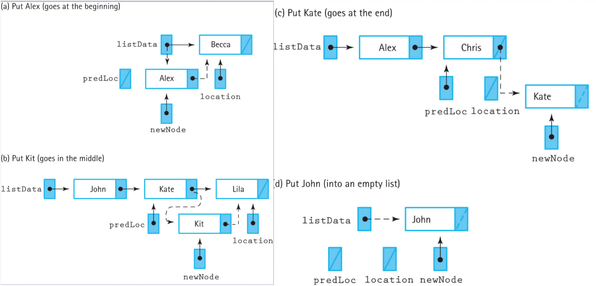

# Basic Concepts

### Software Engineering 
```
A disciplined approach to the design, production, and maintenance of computer programs
```

### Abstraction
```
[Abstraction]: a model of a complex system that includes only the essential details
[Information Hiding]: simplify work by hiding complex details

- Programs are abstractions -
--------------------------------------------------------------------
[.h]    file explains how the class work, what functionalities and properties it has
[.cpp]  detailed implementations of how each function/properties works
```

### Functional Decomposition v.s Object-oriented Design
```
[1] functional decomposition 
     >> breaks the program into functions 
     >> these functions form a complete solution to the problem when used together

[2] Object-oriented Design 
     • Divide-and-Conquer: break down the program into things instead of tasks
     • The design consists of objects, which are defined by classes
     • Objects combine data and operations
```
```
[Quote]

Grady Booch, "what Is and Isn't Object Oriented Design", 1989
-------------------------------------------------------------
"Read the specification of the software you want to build. 
 Underline the verbs if you are after procedural code, 
 the nouns if you aim for an object-oriented program."
```

### BUG
```
[1] Compile-Time Errors
     • unclean
     • syntactically incorrect
     • know your programming language, editor, etc

[2] Run-Time Errors
     • errors occur during execution, often causing the program to crash
     • (Robustness): the ability of a program to recover from an error 
     • often found with sufficient testing
```

### TEST 
```
[1] Program Verification
     • checking if a program fulfills specification: "Are we doing the job right?"

[2] Program Validation
     • checking if the program fulfills its intended purpose: "Are we doing the right job?"

[3] Precondition
     • a condition that must be true before an operation is exexuted

[4] Postcondition
     • a condition that will be true after an operation completes

[5] Exceptions
     • allow programs to interrupt normal control flow to handle exceptional situations
     • handling them should be part of the design
```

### Abstract Data Type (ADT)
```
Data 
• representation of information 
  in a manner suitable for communication or analysis by humans or machines

Data are nouns of the programming world
• The objects that are manipulated
• The information that is processed

Definition 
• A data typen whose (logical) properties (domain and operations) 
  are specified independently of any particular implementation.
```

### Different views of ADT 
#### • Application Level
```
modeling real-life data in a specific context, also known as user level
```
#### • Logical Level
```
abstract view of the domain and operations
```
#### • Implementation Level
```
specific representation to hold the data items, and implementation of operations
```
#### • Ex: ADT List
```
(Application Level) 
  : modeling real-life list, a homogeneous collection of elements with a linear relation
  => there is one first element 
  => every element except first one has a unique predecessor
  => every element except last one has a unique successor

(Logical Level)
  : operations supported: PutItem(), GetItem(), DeleteItem(), GetNext(), ...

(Implementation Level)
  : implemented using array, linked list, or other; codes for operations
```

#### • Library Example
```
[1] Application Level: Public Library that you can make the use of 

[2] Logical Level: 
     > domain is a collection of books; 
     > operations inclues, check book out, check book in, pay fine, reserve a book

[3] Implementation Level:
     > representation of the structure to hold "books", and the coding for operations
```

### ADT operations
```
• Constructor: creates a new instance (object) of an ADT

• Transformer (setter): changes state of the data values of an instance

• Observer (getter): observe the state of the data values without changing them

• Iterator (loop): allows us to process all the components in a data structure sequentially
```
### C++ Data Types

#### • Simple
```
[1] Integral (完整的)
     > char
     > short
     > int 
     > long
     > enum

[2] Floating (有小数点)
     > float 
     > double
     > long 
     > double

[3] Address 
     > pointer 
     > reference 
```
#### • Composite
```
[1] Definition 
     : stores a collection of individual data components under *one variable name*,
       allows individual components to be accessed

[2] Type 
     > array 
     > struct 
     > union 
     > class 
```

### Unstructured v.s structured data types
#### • Unstructured 
```
components are [not] organized with respect to one another
e.g. strcut and classes
```
#### • Structured 
```
organization of components determines method used to access individual components
e.g. arrays
```


### Pass-by-value v.s pass-by-reference
#### • Pass by value
```
    sending a copy of the contents of the actual argument
    -----------------               -------------------
    |               |    a copy     |                 |
    | calling block | ------------> | Function Called |
    |               |               |                 |
    -----------------               -------------------
    so, actual argument cannot be changed by the function 
```

#### • Pass by reference (&)
```
 sends the location (memory address) of the actual argument 
    -----------------                -------------------
    |               |    location    |                 |
    | calling block | -------------> | Function Called |
    |               |                |                 |
    -----------------                -------------------
  function access actual argument itself (not just a copy)
```
### Typedef definition
```
typedef: 

[1] Is a reserved keyword in the programming languages C and C++
[2] It is used to create an additional name (alias) for another data type
[3] It is often used to simlify the syntax of complex data structure (struct/class)
[4] used to provide specific descriptive type names for integer data type of varying sizes
     > int
     > double 
     > long
     > ...

[ex]. 
const int NUM_DEPTS = 5;
const int NUM_MONTHS = 12;
const int NUM_STORES = 3;
typedef long MonthlySalesType [NUM_DEPTS] [NUM_MONTHS] [NUM_STORES];
MonthlySalesType monthSales;

=> here MonthlySales is a 3 dimensonal array that could hold up to 5*12*3 amount of value
=> so it's also a alias of basic type long


                -------------------------------------------------
                |   |   |   |   |   |   |   |   |   |   |   |///|  <- monthlySales[0][11][2]
            ----------------------------------------------------|
            |   |   |   |   |   |   |   |   |   |   |   |   |   |  
  ---   ----------------------------------------------------|---|
   |    |   |   |   |   |   |   |   |   |   |   |   |   |   |   |
   |    |-----------------------------------------------|---|---|
   |    |   |   |   |   |   |   |   |   |   |   |   |   |   |   |
        |-----------------------------------------------|---|---|
   5    |   |   |   |   |   |   |   |   |   |   |   |   |   |   |
  rows  |-----------------------------------------------|---|----    ---
        |   |   |   |   |   |   |   |   |   |   |   |   |   |        /
   |    |-----------------------------------------------|----   3 widths
   |    |   |   |   |   |   |   |   |   |   |   |   |   |          /
  ---   -------------------------------------------------        ---

        | ----------------- 12 columns -----------------|
```
### Namespaces
```
• Definition: 
  >> In computing, a namespace is a set of signs (names) that are used to identify and 
     refer to objects of various kinds. A namespace ensures that all of a given set of 
     objects have unique names so that they can be easily identified.

• Example:
  namespace mySpace
  {
      // all variables and functions within this block must be accessed using 
      // scope resolution operator (::) for avoiding namespace pollution
  }

• Three ways to access members within a Namespace 
    + Qualify each reference:
        > mySpace::name with every reference 
    
    + Using declaration:
        > using mySpace::name;
        ( All future references to name refer to mySpace::name )

    + Using directive:
        > using namespace mySpace;
        ( All members of mySpace can be referenced without qualification )
```

### Scope of variables
```
-------------------------
| Type: local & global  |
-------------------------

[ex].
--------------------------------------------------------------------------------------------
#include<iostream>
using namespace std;

int global = 5;                 // global variable 

int func() 
{
    int local = 3;              // local variable 
    int global = 10;            // local variable with same name as the global variable
    
    cout << global << endl;     // 10 compiler will assign global to 10 because run in lines
    cout << ::global << endl;   // 5  the way of accessing global varibles in local ::
    cout << local << endl;  ;   // 3  local variable
}

int main() 
{
    cout << local << endl;      // can't access out of where local variables is defined
}

```

### Structs (alias: records)
```
[ex].

struct NameType {
   char first[15];
   char middleInit;
   char last[15];
};

struct StudentType {
   NameType name;               // any structure can be a member of a struct 
   int      idNum;
   float    credits;
   float    gpa;
};
StudentType student1,student2;  
student1.name.last;             // accessing struct member using dot(.)
student2.name.first[0];         // accessing struct member that is an array
```


# Array
```
In C++, array cannot be assigned one to another

[ex]. 
{
    int arr1[] = {1, 2, 3};
    int arr2[3];

    arr2 = arr1
}
output[1] error: array type 'int[3]' is not assignable

------------------------------------------------------

nor can be the return type of a function in C++

[ex].
output[2] error: array type cannot be return 
```

### One-dimensional Array
```
C++ array elements are stored in a contiguous memory block with a base address

float values[5];      // assume 4 bytes for float

Base address (lowest address) 
    |
    |       
    ------->    7000        7004        7008        7012        7016
            -------------------------------------------------------------
            |           |           |           |           |           |
            -------------------------------------------------------------
              values[0]   values[1]   values[2]   values[3]   values[4]

    Address of values[index]?
    = Address(index) = BaseAddress + Index * SizeOfElement

```


### Two-dimensional Array
```
[1] A two-dimensional array is a structured composite data type made up of a finite, 
     fixed size collection of homogeneous elements having relative positions given 
     by a pair of indexes and to which there is direct access


[2] Array operation (creation, storing values, retrieving values) are performed
     using a declaration and a "a pair of indexes(row & column)" representing
     the component's position in each dimension


• Mental Presentation

        const int NUM_STATES = 50;
        const int NUM_MONTHS = 12;
        int statHighh [NUM_STATES][NUM_MONTHS];
                          rows       columns


                 [0]         [1]                    [10]         [11]
            -------------------------------------------------------------
        [0] |           |           |  .......  |           |           |
            -------------------------------------------------------------
            -------------------------------------------------------------
        [1] |           |           |  .......  |           |           |
            -------------------------------------------------------------
                                          .
                                          .
                                          .
            -------------------------------------------------------------
       [49] |           |           |  .......  |           |           |
            -------------------------------------------------------------

• In Storage
    
        In memory, C++ stores 2D arrays in row order;
        The first row is followed by the second rows, etc.

            8000                8024                8048
            -------------------------------------------------------------
            |   |   |...|   |   |   |   |...|   |   |   |   |...|   |   |
            -------------------------------------------------------------
            | ----------------- | ----------------- |
           12 highs for state 0 | 12 highs for state 1      etc.
            Alabama (first row) | Alaska (second row)
```

### Element address calculation based on a given base address
```
According to the above example
Based Address 8000 
=> to locate an element such as stateHighs[2][7] 
=> the compiler needs to know that there are 12 columns in this two-dimensional array

so, baseAddress + (2*12 + 7) * 2 
--------------------------------
row index = 2, so pass through first and second row (together 24 spots)
column index = 7, the 7th spot in the third row
assume 2 bytes for type int, memory address is located with bytes
```
### Passing arrays as function parameters
```
[1] In C++, arrays are always passed by reference, 
     and & is not used with formal parameter type
     Meaning, always pass the base address of an array to function, 
     and function can modify array

[2] protect array from unintentional changes by using "const" in formal parameter 
     and function prototype
```
#### • One Dimensonal Array
##### [-] incorrect way
```
#include <iostream>
using namespace std;
 
// Note that arr[] for fun is just a pointer 
// even if square brackets are used
void fun(int arr[])                                 
{
    int n = sizeof(arr) / sizeof(arr[0]);
    cout << "\nArray size inside fun() is " << n;
}
 
// Driver Code
int main()
{
    int arr[] = { 1, 2, 3, 4, 5, 6, 7, 8 };
    int n = sizeof(arr) / sizeof(arr[0]);
    cout << "Array size inside main() is " << n;
    fun(arr);
    return 0;
}

output[1]: 
Array size inside main() is 8
Array size inside fun() is 2
------------------------------------------------
explain: when passing int arr to fun() in main, it is always treated as a pointer
         so the calculation in fun() will mess up with the sizeof() function
         you can't the correct size of a pointer 
         the solution is passing the size as a parameter to the main as well
```
##### [+] correct way 1
```
#include <iostream>
using namespace std;
void fun(int arr[], int n)                // same as void fun(int arr[], int n)
{                                         // array as parameter is always treated as pointer
    int i;
    for (i = 0; i < n; i++)
        cout << arr[i] << " ";
}
 
// Driver program
int main()
{
    int arr[] = { 1, 2, 3, 4, 5, 6, 7, 8 };
    int n = sizeof(arr) / sizeof(arr[0]);
    fun(arr, n);
    return 0;
}
```
##### [+] correct way 2
```
(when you have function that correctly calculate size with string)

#include <iostream>
using namespace std;

void fun(char* arr)                 // same as void fun(char arr[]) {...}
{
    int i;
    int n = strlen(arr);
    cout << "n = " << n << endl;
    for (i = 0; i < n; i++)
        cout << arr[i] << " ";
}
 
// Driver program
int main()
{
    char arr[] = "comeonbaby";
    fun(arr);
    return 0;
}
```
#### • Two Dimensonal Array
##### [+] method 1
```
// specify the size of columns of 2D array
void processArr(int a[][10]) {
   // Do something
}
```
##### [+] method 2 
```
// pass array containing pointers
void processArr(int *a[10]) {           // passing a pointer of an array of 10 pointers
   // Do Something
}

// When callingint *array[10];
for(int i = 0; i < 10; i++)
   array[i] = new int[10];              // initialize each pointer in the 10 pointer-array
processArr(array);
```
##### [+] method 3
```
#include <iostream>
using namespace std;

void processArr(int **a)
{
    // Do something
}

int main()
{
    int **array;
    array = new int *[10];          // pay attention to how to declare below one
    for (int i=0; i<10; i++)
    {
        array[i] = new int[10];     // in comparison with above one
    }
    for (int i=0; i<10; i++)
    {
        for (int j=0; j<10; j++)
        {
            cout << array[i][j];
        }
        cout << endl;
    }

    cout << *array << endl;     // print out the first address
    // processArr(array);

    return 0;
}
```

# Object-Oriented Programming
```
• Three inter-related constructs: classess, objects and inheritance 
  
[1] Objects are basic run-time entities in an object-oriented system 
[2] A class defines the structure of its objects 
[3] Classes are organized in an "is-a" hierarchy defined by inheritance
```
### Abstraction 
```
[.h]        file -> data member and member function specification 
[.cpp]      file -> member function implementation 
[main.cpp]  file -> objects being used in here
```
### Inheritance
```
+ Allows programmers to create a new class that is a specialization of an existing class 

    => new class is called a derived class of the existing class 
    => the existing class is the base class of the new class
```
### Polymorphism
```
+ The ability to associate multiple meanings to one function name by means of late binding

+ [late binding]: associated it later in the time 
---------------------------------------------------------------------------------------------
| <1>. you have a class named people in the school                                          |
| <2>. you have derived classes students, teachers, director, etc                           |
| <3>. they all could have a method call goToWork()                                         |
|      but it's not necessary that we need to define them everytime in each child class     |
| <4>. a good way is it only defined in the base class, and every child can call goToWork() |
| <5>. when different classes call goToWork(), they behave differently                      |
| <6>. teacher go to teach, student go to study, ...etc                                     |
---------------------------------------------------------------------------------------------

+ [ virtual function ]:

    => we can achieve that by making the "goToWork()" function virtual 
    => late (dynamic) binding <官方定义>

    ex).
    [ place virtual keyword in base class definition, not implementation ]
            
        § this tells the compiler to wait until runtime 
          then to determine the implemetation of the function 
          based on the object that calls it

        § if there is a derived class with a redefined version of the function 
          it will use that version instead of the original

```
### Composition

### *Templates

# Error & Exception Management
### Define your own [Exception](http://peterforgacs.github.io/2017/06/25/Custom-C-Exceptions-For-Beginners/) 
```
Exception is an user-defined class
```
### Try/throw/catch
```
#include <iostream>
using namespace std;
 
class demo {
};
 
int main()
{
    try {
        throw demo();
    }
 
    catch (demo d) {
        cout << "My Exception Happens \n";
    }
}
```
### Employ pre-defined exception classes/functions
```
// IsFull() in Unsorted linked-list

bool UnsortedType::IsFull() const
// return true if there is no room for another ItemType 
// on the free store; false otherwise 
{
    NodeType* location;
    try
    {
        location = new NodeType;
        delete location;
        return false;
    }
    catch (std::bad_alloc exception)
    {
        return true;
    }
}

```
# Algorithm
```
1. A logical sequence of discrete steps 
2. steps that describe a complete solution to a problem
3. computable in a finite amount of time (meaning it will terminate)
```
### Analysis of algorithm
```
The theoretical study of design and analysis of computer algorithms, not about programming
```
#### • Design
```
[1] design correct algorithms which minimize cost
[2] efficiency is the design criterion
```
#### • Analysis
```
+ predict the cost of an algorithm in terms of resource and performance
```
#### • Basic Goals for designing
```
[1] always correct
[2] always terminates
[3] always care about performance
```
#### • WHY?
```
Computers are always limited in the computational ability and memory
+ Resources are always limited
+ Efficiency is the center of algorithms
```
#### • Growth Rate 
##### [+] Example 1 
```
[Question]: 
determine whether x is one of A[1], A[2],..., A[n], and retrieve information about x.

[Algorithm]: 
go through each number in order and compare it to x 

[pseudocode]:
i = 1;
while  (i <= n) and (A[i] != x) do
i = i + 1;
if (i > n) then i = 0;

[related questions]:
<1> Number of element comparisons?     --> from 1 to n
<2> Worst case?                        --> n
<3> Best case?                         --> 1
```
##### [+] Example 2 
```
Square Matrix Multiplication 

---             ---          ---             ---         ---             ---
|   c11 ... c1n   |          |   a11 ... a1n   |         |   b11 ... b1n   |
|    . .     .    |          |    . .     .    |         |    . .     .    |
|    .   .   .    |     =    |    .   .   .    |    x    |    .   .   .    |
|    .     . .    |          |    .     . .    |         |    .     . .    |
|   cn1 ... cnn   |          |   an1 ... ann   |         |   bn1 ... bnn   |
---             ---          ---             ---         ---             ---
                                      n 
                                      ---
                                cij = \   aik • bkj
                                      / 
                                      ---
                                      k=1 

[pseudocode]:
for i = 1 to n do 
    for j = 1 to n do 
    {
        c[i, j] = 0;
        for k = 1 to n do 
            c[i, j] = c[i, j] + a[i, k] * b[k, j];
    }

[related questions]:
<1> What is the number of multiplications?     --> i * j * k = n^3
<2> What is the number of additions?           --> same? think that later
```
##### [+] explain
```
further abstraction we use in algorithm analysis is to characterize in terms of growth 

[1] Matrix multiplication time grows as n^3 
[2] Linear search time grows as n 

[why is it important?]
input size   |    n    |   nlgn   |   n^2   |   n^3   |   2^n   |
    10       | 0.00001 |   ....   |   ...   |  0.001  |  < 0.01 |   => unit: sec
    100      | 0.0001  |   ....   |   ...   |  1 min  |    ∞    |
    1000     | 0.001   |   ....   |   ...   |  17.64  |    ∞    |   => unit: min
    10000    | 0.01    |   ....   |   ...   |  11.76  |    ∞    |   => unit: days
```
### Big O Notation 
```
The worst case (upper bound) of the algorithm execution time
```
<!--  -->


### Comparison of algorithm
```
[Goal]: Compare the efficiency of different algorithm, efficiency is what matters!
```
#### • One problem Two Algorithm
```
[problem]: Calculate the sum of the integers from 1 to N, i.e. 1+2+3+...+(N-1)+N 

[Alg #1]:                           --> performs N addition/assignment operations 
sum = 0;
for (count=1; count<=N; count++)
     sum = sum + count;

[Alg #2]:                           --> one addition, one multiplication and one division
sum = (1+N)*(N/2);
```
#### • How to compare ?
```
[1] Compare the actual running time on a computer 
[2] Compare the number instructions/statements executed
     a) varies with languages used and programmer's style 
     b) count the number of passes through a "critical loop" in algorithm 
[3] Count representative operations performed in the algorithm
```
# Pointers
```
A pointer variable contains the memory address of another variable 

[for what]: for indirect addressing of data and for dynamic allocation of memory 
```
### Declaration
```
use an aterisk(*)
-----------------
int* intPointer;
```
### Manipulation (operation)
```
// ampersand(&) returns the address of a variable
int alpha = 10;
int* intPointer = &alpha;                       // return a address like this: 0x16ba0f49c

// accessing variables value through pointer 
*intPointer = 25;                               // alpha is now 25
```
# Dynamic Memory Allocation
#### • Static
```
(when): compile time
allocates a fixed amount of memory during compile time, pre-specify in declaration 
```
#### • Dynamic memory allocation 
```
(when): runtime
Allocation of memory space for a variable at run time, as opposed to static one

(where):
Dynamic allocation creates variables on heap (or free store),
a section of memory reserved for dynamic allocation
```
### Use cases
Dynamic allocation uses the keyword **new**
```
int* ptr = new int;
// new returns a pointer to the newly allocated int on the heap
// and the value can only be accessed via this pointer

(new):
      • pointers can point to nothing using NULL 
      • if no memory is available on the heap, new operator returns NULL (for check memory)
```
### Memory Leak Issue
```
A memory leak is the loss of available memory space 
that occurs when some "dynamically" allocated memory is never deallocated, called garbage
```
#### • Example 
```
float* money = new float;
*money = 33.46;
float* myMoney = new float;
```

<br>

```
•myMoney = *money;                  // set the value of myMoney = the value of money
```

<br>

```
myMoney = money;                    // set the memory address of myMoney = money's
```

<br>

```
The memory cell originally used by myMoney is now inaccessible.
Since there's no way to collect the garbage, it is small memory leak
```
#### • Delete Operation 
```
[1] If it is single variables 
     >> delete myMoney;              // safely clean up the memory allocated to myMoney

[2] If it is array variables
     >> delete [] myArray;           // deleting array
```
### *Static v.s Dynamic arrays 
### *initialization

# Lists
### Linked List 
A collection of **nodes** that are <u>linked together</u> in a chain using **pointers**
#### • Node 
```
[1] basic component of a linked list, store data and a pointer to the next node
[2] Nodes are created when needed using dynamically allocated memory 
[3] The last node in the list has a NULL pointer
```
#### • Observer (getter)
#### • Transformers (setter)
#### • Iterator

#### • Member Functions
##### [+] *PutItem*
```
! Order Matter, do step 4 over step 3 will cause memory leak
------------------------------------------------------------
1) Create a new node 
2) Set the node's info to the input data 
3) Set the node's next pointer to the listData, the first item in the list
4) Set listData to point to the new node
```


```
void UnsortedType::PutItem (ItemType item)
// Pre: list is not full and item is not in list 
// Post: item is in the list; length has been incremented
{
    NodeType* location;
    // create a new node and fill it 
    location = new NodeType;
    location->info = item;
    location->next = listData;

    // the new node becomes head of the list 
    listData = location;
    length++;                                 // record the length of linked list
}
```
```
Put into Empty list 
1) create new node 
2) make new node point to NULL 
3) make listData point to NULL 
```
##### [+] *Constructor*
```
1) Largely unchanged
2) Set length to 0 
3) Set the external pointer to NULL
```
##### [+] *IsFull* 
```
! Linked list don't have an explicit size space
! try if you can allocated new memory for limit
! btw, dynamic memory is located in the heap
```
##### [+] *MakeEmpty*
```
100% sure this one is an iterator

! delete always start from the head
1) makeEmpty() must deallocate each node individually in order to empty the list 
2) This is accomplished using a while loop 
3) Iteration starts at listData, the head of the list, and continues using listData->next 
4) Iteration stops when listData is NULL
```
##### [+] *GetItem*


```
Linear Search through the list to find the desired item
```
<br>

##### [+] *DeleteItem*


```
1) tempPtr to locate the item that need to be deleted, link it; 
2) predecessor(previous pointer) point to location->next 
3) delete the tempPtr
```
<br>

#### • Comparing Implementations 


### Sorted v.s Unsorted Lists
#### • Unsorted List
refer to above example and all **member functions**
#### • Sorted List
##### [+] Logical Level (no changes)
```
1) Only change from unsorted list is guaranteeing list elements are sorted
2) Order is determined by ItemType's CompareTo method 
3) PutItem and DeleteItem pre- and post- condition: list is sorted and remains sorted
```
##### [+] Application Level (no changes)
```
1) Nothing has changed for the user, list interface is exactly the same
2) GetNextItem will return the next item in key order
```
##### [+] Imlementation Level (few changes)
```
-----------------------------------------------------------------
|   1) PutItem, DeleteItem: Ensure list remains Sorted <br>     |
|   2) GetItem can be improved                                  |
-----------------------------------------------------------------
```
### Sorted List implementations
#### • Array-based (static) 
```
[array-based]:
the length field must be present in order to define the extent of the list within the array
```
**PutItem**
```
(Linear Search is required)
1) Find the space where new element should go
2) create space for new element, by moving all subsequent elements down one space
3) insert the element in the space
4) increment the length by 1
```


**DeleteItem**
```
1) assume item for deletion is in the list, simple linear search find them
2) when found, move subsequent element up one space (overwritting)
3) decrement the length by 1
```
**GetItem**

```
Binary Search (more to come in the following section)
```


#### • Array-based (dynamic) 
```
few changes:

1) Parameteried constructor: allows user to specify max number of items
2) Defafult constructor: ____you_know_what_to_do_____
3) Destructor: cleans up the memory on the heap when the rest of the list is removed
4) store the max list size instead of using a constant: 
    >> length == maxList;
```


##### [+] *Destructor*
```
! object is deallocated when it leavs scope, but any data it points to is not -> memory leak

1) class destructor is a needed to implicitly invoked when a object leave scope
2) ~UnsortedList() => clean up memory by deallocating all the nodes in the list

--------------------------------------------------------------------------------------------
// for array-based destructor 
// we create a pointer of an array, which stores the address of first location in array
// delete that is enough

UnsortedType::~UnsortType()
{
    delete [] arrayPtr;
    cout << "destructor called" << endl;
}
```
#### • Linked list-based
```
functions to change:
-> GetItem()
-> PutItem()
-> DeleteItem()
```
##### [+] *NodeType* 
```
struct NodeType
{
    ItemType info;
    NodeType* next;
}
```
##### [+] *Constructor*
```
SortedType::SortedType()    // Class constructor 
{
    length = 0;
    listData = NULL;
}
```
##### [+] *IsFull*
```
bool SortedType::IsFull() const 
// Returns true if there is no room for another ItemType 
// on the free store; false otherwise 
{
    NodeType* location;
    try 
    {
        location = new NodeType;
        delete location;
        return false;
    }
    catch (std::bad_alloc exception)
    {
        return true;
    }
}
```
##### [+] *MakeEmpty*
```
// deletion always starts with the head
void SortedType::MakeEmpty()
{
  NodeType* tempPtr;

  while (listData != NULL)
  {
    tempPtr = listData;
    listData = listData->next;
    delete tempPtr;
  }
  length = 0;
}
```
##### [+] *GetItem*
```
-------------------------------------------------------------------------------------
|                                                                                   |
|   loop through the linked list:                                                   |
|   if (CompareTo == Equal) { returm item };                                        |
|   elif (CompareTo == Less) { cout << "Item is not in the list" << endl; };        |
|                                                                                   |
|-----------------------------------------------------------------------------------|
|                                                                                   |
|   ! Cannot use Binary Search int this case                                        |
|   1) binary search require being able to randomly access elements of the list     |
|   2) Linked lists can only access directly linked nodes one by one                |
|                                                                                   |
-------------------------------------------------------------------------------------
```
```
ItemType SortedType::GetItem(ItemType& item, bool& found)
{
  bool moreToSearch;
  NodeType* location;

  location = listData;
  found = false;
  moreToSearch = (location != NULL);

  while (moreToSearch && !found)
  {
    switch(item.ComparedTo(location->info))
    {
      case GREATER: location = location->next;
                    moreToSearch = (location != NULL);
                    break;
      case EQUAL:   found = true;
                    item = location->info;
                    break;
      case LESS:    moreToSearch = false;
                    break;
    }
  }
  return item;
}
```
##### [+] *PutItem*
```
Can't always look a head (location->next)->info, because exception will happen in the end  

solution. two poitners, recording previous and current Node
1) predLoc
2) location 
```
```
// code
void SortedType::PutItem(ItemType item)
{
  NodeType* newNode;  	// pointer to node being inserted
  NodeType* predLoc;  	// trailing pointer
  NodeType* location; 	// traveling pointer
  bool moreToSearch;

  location = listData;
  predLoc = NULL;
  moreToSearch = (location != NULL);

  // Find insertion point.
  while (moreToSearch)
  {
    switch(item.ComparedTo(location->info))
    {
      case GREATER: predLoc = location;
      	           location = location->next;
                    moreToSearch = (location != NULL);
                    break;
      case LESS:    moreToSearch = false;
                    break;
    }
    
  }

  // Prepare node for insertion
  newNode = new NodeType;
  newNode->info = item;
  // Insert node into list.
  if (predLoc == NULL)         // Insert as first
  {
    newNode->next = listData;
    listData = newNode;
  }
  else
  {
    newNode->next = location;
    predLoc->next = newNode;
  }
  length++;
}
```

<br>
<br>

<br>
<br>

##### [+] *DeleteItem*
```
linear way: compare against "(location->next)->info" to find the item to delete

// code 
void SortedType::DeleteItem(ItemType item)
{
  NodeType* location = listData;
  NodeType* tempLocation;

  // Locate node to be deleted.
  if (item.ComparedTo(location->info) == EQUAL)
  {
    tempLocation = location;
    listData = location->next;	                        // listData point to next location 
  }                                                     // same as saying deleting this node
  else
  {
    while (item.ComparedTo((location->next)->info) != EQUAL)
      location = location->next;

    // Delete node at location->next
    tempLocation = location->next;
    location->next = (location->next)->next;
  }
  delete tempLocation;                                  // because delete tempLocation here
  length--;
}
```


##### [+] *ResetList*
```
// code
void SortedType::ResetList()
{
  currentPos = NULL;
} 

ItemType SortedType::GetNextItem()
{
  ItemType item;
  if (currentPos == NULL)
    currentPos = listData;
  item = currentPos->info; 
  currentPos = currentPos->next;
  return item;

}
```
##### [+] *GetNextItem* 
```
ItemType SortedType::GetNextItem()
{
  ItemType item;
  if (currentPos == NULL)
    currentPos = listData;
  item = currentPos->info; 
  currentPos = currentPos->next;
  return item;

}
```
##### [+] *Destructor (Linked List)*
```
SortedType::~SortedType()
{
  NodeType* tempPtr;

  while (listData != NULL)
  {
    tempPtr = listData;
    listData = listData->next;
    delete tempPtr;
  }
}
```
### Time Complexity/order of magnitude


```
>> memory handle difference

1). Static Array:   specify size at compile time 
2). Dynamic Array:  sepcify size at run-time 
3). Linked likst:   as long as computer has memory
```

### Bounded and Unbounded ADTs
#### • Bounded 
```
There is a logical limit on the number of items in the structure
----------------------------------------------------------------
>> array-based list is bounded, but you can modify it into dynamic memory allocated version 
>> so that storage can be expanded as long as there are space in the heap
```
#### • Unbounded
```
no logical limit on the number of items in ths structure
---------------------------
>> Linked list is Unbounded
```
# Stacks (ADT)
```
Last in First Out (LIFO)
```
### Properties
#### • Logical Level
```
A stack is an ADT in which elements are added and removed from only the top of the stack


    class StackType
    {                                                   Push     Pop
    public:                                               |       ^
        StackType();                                      v       |
        bool IsFull() const;                            |           |
        bool IsEmpty() const;                           |           |   ---> Top 
                                                        |-----------|
        void Push( ItemType item);                      |           |
        void Pop();                                     |-----------|
        ItemType Top() const;                           |           |
                                                        |-----------|
    private:                                            |           |
        int top;                                        |-----------|
        ItemType items[MAX_ITEMS];                      |           |
    };                                                  -------------

```
#### • Application Level 
```
1) Palindorome 
2) Any kind of reversing data work, etc

// code
```
### Implementation 
#### • Array-based 
```
#include "StackType.h"


StackType::StackType(int max)               // custom constructor
{
  maxStack = max;
  top = -1;
  items = new int[maxStack];
}
--------------------------------------------------------------------------------------------

StackType::StackType()                      // default constructor
{
  maxStack = 500;
  top = -1;
  items = new int[maxStack];
}
--------------------------------------------------------------------------------------------

bool StackType::IsEmpty() const             // check if the top == -1
{
  return (top == -1);
}
--------------------------------------------------------------------------------------------

bool StackType::IsFull() const              // check if the top == max - 1
{
  return (top == maxStack-1);
}
--------------------------------------------------------------------------------------------

void StackType::Push(int newItem)           
{
  if (IsFull())                             // user-defined exception FullStack()
    throw FullStack();                      // throw that if IsFull() = true
  top++;                                    // else top increment 1
  items[top] = newItem;                     // let items[top] = newItem
}
--------------------------------------------------------------------------------------------

void StackType::Pop()
{
  if( IsEmpty() )                           
    throw EmptyStack();                     // throw user-deined exception EmptyStack()
  top--;                                    // since it's array, don't really need to delete
}                                           // decrement top value, later overwrite for push
--------------------------------------------------------------------------------------------

int StackType::Top()
{
  if (IsEmpty())
    throw EmptyStack();
  return items[top];                        // return the top item
}    
--------------------------------------------------------------------------------------------

StackType::~StackType()
{
  delete [] items;                          // delete array pointer
}
--------------------------------------------------------------------------------------------
```


#### • Linked list-based 
```
#include "StackType.h"

struct NodeType                             // Node Type
{
  int info;
  NodeType* next;
};
--------------------------------------------------------------------------------------------

StackType::StackType()
{
  topPtr = NULL;                            // constructor
}
--------------------------------------------------------------------------------------------

bool StackType::IsFull() const              // check if there's still memory
{
    NodeType* location;
  try
  {
    location = new NodeType;
    delete location;
    return false;
  }
  catch(std::bad_alloc exception)
  {
    return true;
  }
}
--------------------------------------------------------------------------------------------

// destructor (iterator)
StackType::~StackType()
{
  NodeType* tempPtr;                        // use tempPtr 

  while (topPtr != NULL)                    // as long as tempPtr != NULL
  {                                         // not yet reach the end
    tempPtr = topPtr;
    topPtr = topPtr->next;
    delete tempPtr;
  }
}
--------------------------------------------------------------------------------------------

bool StackType::IsEmpty() const
{
  return (topPtr == NULL);
}
--------------------------------------------------------------------------------------------

// Linked-List is automatically a stack seeing from left to right (as Top to Down in stack)
void StackType::Push(int newItem)
{
  if (IsFull())
    throw FullStack();                      // check if full
  else
  {
    NodeType* location;                     // not full, create new node to store newItem
    location = new NodeType;                // record address 
    location->info = newItem;               // record info
    location->next = topPtr;                // let newNode point to the first Node
    topPtr = location;                      // set topPtr pointing to the new Node
  }
}
--------------------------------------------------------------------------------------------

void StackType::Pop()
{
  if (IsEmpty())
    throw EmptyStack();                     // check if empty
  else
  {  
    NodeType* tempPtr;                      // use tempPtr for deletion from the head
    tempPtr = topPtr;                       // refer to the figure below
    topPtr = topPtr->next;
    delete tempPtr;
  }
}
--------------------------------------------------------------------------------------------

int StackType::Top()
{
  if (IsEmpty())
    throw EmptyStack();                     // check if empty
  else
    return topPtr->info;                    // return top value
}
--------------------------------------------------------------------------------------------

```


#### • Complexity Comparison 


# Queues
```
First in, First Out (FIFO)
```
### Properties 
#### • Logical Level 
```
A queue is an ADT in which elements are added to the rear and removed from the front

class QueueType
{
public:
    QueueType(int max);
    QueueType();
    ~QueueType();

    bool IsEmpty() const;
    bool IsFull() const;
    void Enqueue(ItemType item);    // add newItem to the rear of the queue 
    void Dequeue(ItemType& item);   // remove front item from queue

private:
    ItemType* items;                // Dynamically allocated array 
    int maxQue;                     // max length 
};


                   Front                             Rear 
                  _________________________________________
                  |       |       |       |       |       |
    Dequeue -->   |       |       |  ...  |       |       |   <-- Enqueue
                  -----------------------------------------

```
##### [-] Fixed-Front Queue 
```
(no efficient, waste a lots of memory space)
```


##### [+] Floating Queue (focus on this)
```
1) more efficiient
```

```
2) when rear is the indeed the last item in the queue => wrap around => use modulus(mod %)

// (rear+1) % length, in this case 5
```


```
3) Issue with set front and rear directly

=> in the following situation, cannot distinguish Empty Queue & Full Queue
```


```
4) Fix this Issue
----------------------------
Solution [1]: more intuitive
{...count the length...}

------------------------------------------------------------------------
Solution [2]: less intuitive, but cooler and efficient, go with this one
```


```
[empty queue]:
1) according to figure 1 above, when Dequeue 
2) front += 1 
3) since front is the index before actual front item, front == rear gives empty queue

-------------------------------------------------------------------------------------

[full queue]:
1) according to figure 2 above, when front = 2 while the actual front is at index = 3
2) rear + 1 = front, indicates Full

-------------------------------------------------------------------------------------

// front = index of the array slot "preceding" the front element in the queue
// always reserve this slot to be empty(never store queue element here)
// if we initialize a queue with 100, what we actually use is 99 space
```
#### • Application Level
```
// For users simplicity, maxQue = max + 1;
// because by adopting the solution 2, we will have empty space in the queue
```
### Implementation 
#### • Array-based 
```
#include "QueType.h"

// Post: (1) maxQue, front, and rear have been initialized. 
//       (2) The array to hold the queue elements has been dynamically allocated.
QueType::QueType(int max)
{
  maxQue = max + 1;
  front = maxQue - 1;
  rear = maxQue - 1;
  items = new int[maxQue];
}
---------------------------------------------------------------------------------------------

// Post: (1) maxQue, front, and rear have been initialized. 
//       (2) The array to hold the queue elements has been dynamically allocated.

QueType::QueType()                                  // Default class constructor
{
  maxQue = 501;
  front = maxQue - 1;
  rear = maxQue - 1;
  items = new int[maxQue];
}
---------------------------------------------------------------------------------------------

// Destructor
QueType::~QueType()
{
  delete [] items;
}
---------------------------------------------------------------------------------------------

// Post: front and rear have been reset to the empty state.
void QueType::MakeEmpty() 
{
  front = maxQue - 1;                               // don't really need to delete
  rear = maxQue - 1;                                // array-based just override
}
---------------------------------------------------------------------------------------------

bool QueType::IsEmpty() const
{
  return (rear == front);
}
---------------------------------------------------------------------------------------------

bool QueType::IsFull() const
{
  return ((rear + 1) % maxQue == front);            // mod used here
}
---------------------------------------------------------------------------------------------

// Post: If (queue is not full) newItem is at the rear of the queue; 
// otherwise a FullQueue exception is thrown.  
void QueType::Enqueue(int newItem) 
{
  if (IsFull())
    throw FullQueue();
  else
  {
    rear = (rear +1) % maxQue;                     // include % in the calculation
    items[rear] = newItem;                         // deal with the situation rear is the end
  }
}

        ____________________________________________
        |       |       |          |       |       |    front = 2 
        |   C   |       | reserved |   A   |   B   |
        |       |       |          |       |       |    rear = 0
        --------------------------------------------
           [0]     [1]      [2]       [3]     [4]

           // rear is 0, plus 1 will result in 1
           // add item at there

---------------------------------------------------------------------------------------------

// Post: If (queue is not empty) the front of the queue has been removed 
// and a copy returned in item; othersiwe a EmptyQueue exception has been thrown.
void QueType::Dequeue(int& item)
{
  if (IsEmpty())
    throw EmptyQueue();
  else
  {
    front = (front + 1) % maxQue;
    item = items[front];
  }
}

        ____________________________________________
        |       |       |          |       |       |    front = 2 
        |   C   |       | reserved |   A   |   B   |
        |       |       |          |       |       |    rear = 0
        --------------------------------------------
           [0]     [1]      [2]       [3]     [4]

        // since we preserve the index before actual front item as "front"
        // use front + 1 to locate actual front item

---------------------------------------------------------------------------------------------
```
#### • Linked list-based 

```
---------------------------------------------------------------------------------------------
|                                                                                           |
|                                                                                           |
|   // Header file for ADT queue                                                            |
|                                                                                           |
|   class FullQueue {};                                                                     |
|                                                                                           |
|   class EmptyQueue {};                                                                    |
|                                                                                           |
|   typedef char ItemType                                                                   |
|   struct NodeType;                                                                        |
|                                                                                           |
|   class QueType                                                                           |
|   {                                                                                       |
|   public:                                                                                 |
|       QueType();                                                                          |
|       ~QueType();                                                                         |
|                                                                                           |
|       void MakeEmpty();                                                                   |
|       void Enqueue(ItemType);                                                             |
|       void Dequque*ItemType&);        // item store copies is a node, modify it ditectly  |
|       bool IsEmpty() const;                                                               |
|       bool IsFull() const;                                                                |   
|                                                                                           |
|   private:                                                                                |
|       NodeType* front;                                                                    |
|       NodeType* rear;                                                                     |
|   };                                                                                      |
|                                                                                           |
|                                                                                           |
---------------------------------------------------------------------------------------------


---------------------------------------------------------------------------------------------

#include <new>                                      // for bad_alloc

struct NodeType
{
    ItemType info;
    NodeType* next;
};

// Post: front and rear are set to NULL
QueType::QueType()                                  // class constructor
{
    front = NULL;
    rear = NULL;
}
---------------------------------------------------------------------------------------------

// Post: Queue is empty; all elements have been deallocated
void QueType::MakeEmpty()
{
    NodeType* tempPtr;

    while (front != NULL)
    {
        tempPtr = front;
        front  = front->next;
        delete tempPtr;
    }
    rear = NULL;
}
---------------------------------------------------------------------------------------------

// destructor
QueType::~QueType()
{
    MakeEmpty();                // deallocate all the nodes, set front and rear to NULL
}
---------------------------------------------------------------------------------------------

// returns true if there is no space for another NodeType object in heap memory
// false otherwise
bool QueType::IsFull() const
{
    NodeType* location;
    try
    {
        location = new NodeType;
        delete location;
        return false;
    }
    catch(std::bad_alloc exception)
    {
        return true;
    }
}
---------------------------------------------------------------------------------------------

// return true if there are no elements on the queue and false otherwise
bool QueType::IsEmpty() const
{
    return (front == NULL);             // only need to check front's value, front is a node
}
---------------------------------------------------------------------------------------------

// add newItem to the rear of the queue
// pre:  Queue has been initialized
// post: If (queue is not full), newItem is at the rear of the queue, otherwise FullQueue()

void QueType::Enqueue(ItemType newItem)
{
    if (IsFull())
        throw FullQueue();
    else
    {
        NodeType* newNode;              // create newNode for storing newItem into info

        newNode = new NodeType;
        newNode->info = newItem;
        newNode->next = NULL;           // item is added from the rear, it points to NULL
        if (rear == NULL)               // check if this is the first node
            front = newNode;
        else
            rear->next == newNode;      // rear originally point to second last node
                                        // rear->next make the second last point to newNode
                                        // remember newNode here is a pointer (address)
        rear = newNode;                 // directly make rear pointer = newNode pointer
    }
}
---------------------------------------------------------------------------------------------

// remove front item from the queue and returns(store) it in item variable
// pre:  Queue has been initialized
// post: If (queue is not empty), the front of the queue has been removed 
//       and a copy returned in item, otherwise EmptypQueue() exception

void QueType::Dequeue(ItemType& item)
{
    if (IsEmpty())
        throw EmptyQueue();
    else
    {
        NodeType* tempPtr;

        tempPtr = front;
        item = front->info;
        front = front->next;

        if (front == NULL)
            rear = NULL;
        delete tempPtr;
    }
}
---------------------------------------------------------------------------------------------
```
