# conda sqlite
```
>> conda actiavte "env"
>> conda install -c conda-forge ipython-sql
```


# Database Management System (DBMS)

### Basic Goals
```
[1] collect & store
[2] efficiently query 
[3] safely update
[4] design trade-offs
```

### Basic Concepts
#### • Definition
```
1) A large, integrated collection of data

2) Models a real-world enterprise

    + Entities (e.g. students, courses)
    + Relationships (e.g. Chris is enrolled in course 145) 

3) a piece of software designed to store and manage databases


                  ---                                               ---
    Students        |                          who takes what         |
    Courses         |-- Entities                                      |-- Relationships
    Professors      |                          who teaches what       |
                  ---                                               ---


```

#### • Data Model 
```
A data model is a collection of concepts for describing databases 
    
    + The relational model of data is the most widely used model today 
    + relation table
```

#### • Schema 
```
A schema is a description of a particular collection of data, using the given data model 

    + every relation in a relational data model has a schema describing types
```

##### [1] Logical Schema
```
Logical Schema 
    
    + Students  (sid: string, name: string, gpa: float)
    + Courses   (cid: string, cname: string, credits: int)
    + Enrolled  (sid: string, cid: string, grade: string)
```
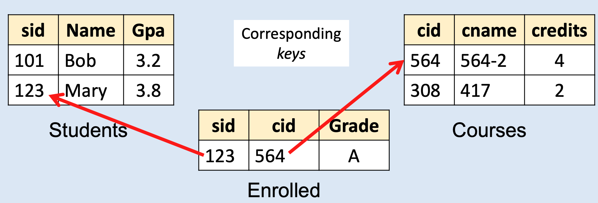 
<br>

##### [2] Physical Schema 
```
1) Administrator Level 
2) describe data layout 
    + Relations as unordered files
    + Some data in sorted order (index)
```

##### [3] External Schema 
```
1) Application Level
2) Views
    + course_info (cid: string, enrollment: integer)
    + Derived from other tables
```

#### • Data Independence 
```
Applications do not need to worry about how the data is structure and stored 
```
##### [1] Logical Data Independence
```
Don't ask can we add a new entity or attribute without rewriting the applications 
: you can

>> protection from changes in the logical structure of the data
```
##### [1] Physical Data Independence
```
Don't ask which disks are the data stored on? Is the data indexed?
: you don't need to know 

>> protection from physical layout changes
```

#### • Key Concepts (challenges)
##### [1] Transaction & Atomicity 
```
1) Transaction (TXN): an atomic sequence of database actions (reads/writes)

2) Atomicity: an action either completes entirely or not at all
                                         --------    ----------

ex).                        _________________________________
Acct  |  Balance            |                               |              Acct  |  Balance 
----------------            | Transfer $3K from a10 to a20: |              ----------------
a10   |  20,000      -->    | 1. Debit $3k from a10         |    -->        a10  | 17,000
a20   |  15,000             | 2. Credit $3k to a20          |               a20  | 18,000
                            |_______________________________|
                                          (TXN)
                        

!! cautions: 
all instruction in the box is a TXN, while crash of DB could happen either 

    + before 1 
    + after 1 but before 2 
    + after 2 

because the properties of atomicity, 
whichever stage crash happen TXN result in not complete at all 
```
##### [2] Consistency 
```
1) An action results in a state which conforms to all integrity constraints

2) integrity constraints: 
> each course is assigned to exactly one room

3) Transactions leave the DB in a consistent state 
> however, note that DBMS does not understand the real meaning of the constraints consistency 
> burden is still on the user
```
##### [3] Locking (concurrency)
```
1) DBMS ensures that the execution of {T1, ... ,Tn} is equivalent to some serial execution 


2) Locking:
> before reading or writing, 
> transaction requires a lock from DBMS, holds until the end


3) If Ti wants to write to an item x and Tj wants to read x, then Ti, Tj conflict
> Solution via locking: 
    + only one winner gets the lock 
    + loser is blocked (waits) until winner finishes


4) Write-ahead Logging (WAL)
> keep a log of all the writes done 
> after a crash, the partially executed TXNs are undone using the log
```
### Relational Model
```
1) Relational Model is a precise, implementable procedural representation 
2) We can operate on it, and database maps internally into this procedural language
```
#### • Relational Schema 
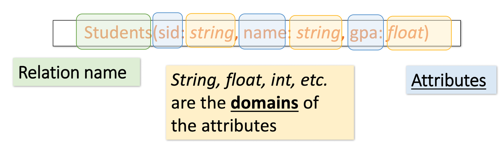
<br>

```
A relational schema describes the data that is contained in a relational instance
```
#### • Relational Instance (Data)
```
A relational instance is a set of tuples(rows) all conforming to the same schema
```
##### [+] Columns
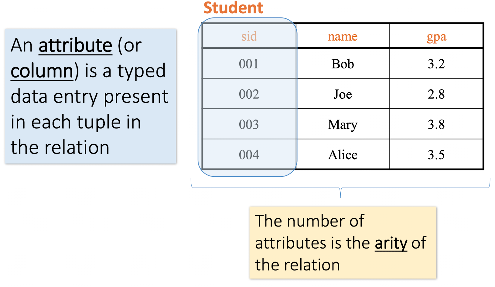
<br> 

##### [+] Rows
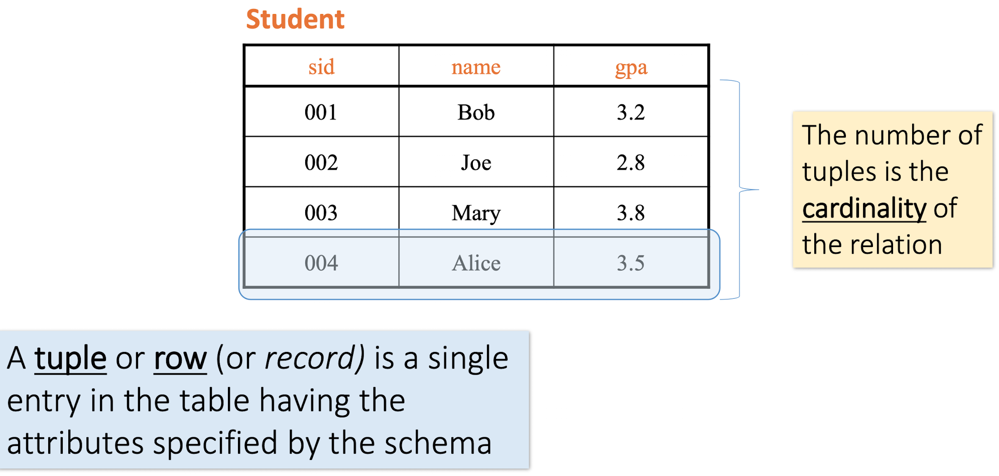
<br>

```
Relational Algebra allows us to translate declarative (SQL) queries into precise and optimizable expressions
```
### Algebra 
```
simple version: operators and atomic operands (操作数)
```
```
1) A language based on operators and a domain of values. 
   Operators map values taken from the domain into other domain values.

2) When the domain is a set of all relations (and the operators are as described later),
   we get the relational algebra

3) We refer to the expression as a query and the value produced as the query result
```
#### • Arithmetic Algebra
```
1) operands are variables and constants
2) operators are the usual arithmetic operators 
ex).
(x+y)*2 or ((x+7)/(y-3)) + x
```
#### • Relational Algebra 
```
[!] Domain: set of relations -> relation = table 
```
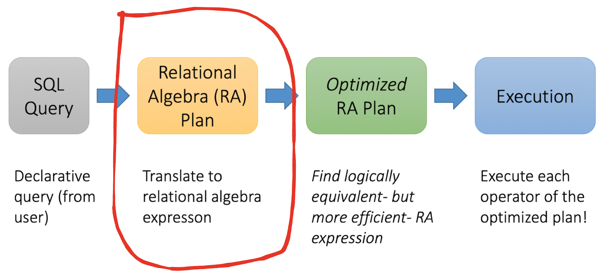

```
1) operands are variables that stand for relations and relations (sets of tuples)
2) RA operates on sets(multisets)
3) every attribute must have a unique name 
```
##### [+] Operations
```
1) Basic Operators (5)
   > select 
   > project  
   > union 
   > set difference
   > Cartesian product (cross product)
   
2) Derived Operators
   > intersection, complement
   > renaming: p
   > join (natural, equi-join, theta join)
```
##### [+] Classfication 
```
1) Operations that remove parts of relations:
    + selection 
    + project 

2) Operations that combine tuples from two relations:
    + Cartesian product
    + join 

3) Since each operation returns a relation 
    + operations can be composed
```

#### • Relational Query Languages 
```
Language for describing queries on a relational database 
```
##### [+] Structured Query Language (SQL)
```
1) Predominant application-level query language 
2) Declarative 
```
##### [+] Relational Algebra 
```
1) Intermediate language used within DBMS 
2) Procedural 
```
### RA Operators
-------
#### • Select Operator
```
produce table containing subset of rows of argument table satisfying condition
                         --------------
```
**&#x03ec;**<sub>condition</sub>(relation)

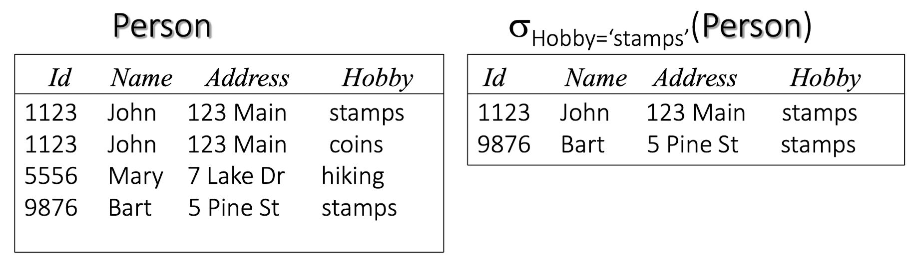
<br>

##### [+] Selection Condition 
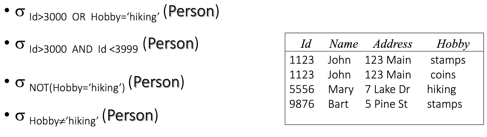

-------
#### • Project Operator 
```
Produces table containing subset of columns of argument table
                          -----------------
```
**&#x03c0;**<sub>attribute_list</sub>(relation)

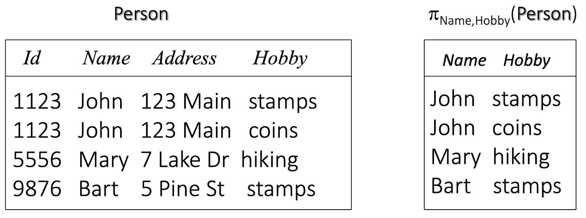

```
result is a table(relation) with no duplicates, it can have fewer tuples than the original
```

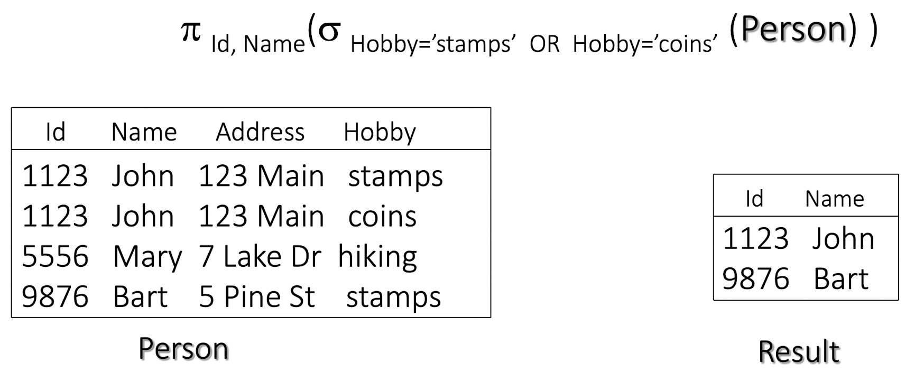

-------
#### • Set Operator 

*Relation is a set of tuples, so set operations should apple: **&#x2229;, U,** ---(set different)*
```
1) result of combining two relations with a set operator is a relation => 
   all its elements msut be tuples having same structure 

2) meaning length of rows and columns must be the same, atrributes must be the same

3) Hence, scope of set operations limited to union compatible relations 
                                             --------------------------
```
##### [+] Union Compatible Relations 
```
Two relations are union compatible if 
    1) both have same number of columns 
    2) Names of atrributes are the same in both 
    3) Attributes with the same name in both relations have the same domain

reiterate: 
+ union compatible relations can be combined using union, intersection and set difference
```

##### [+] Example 
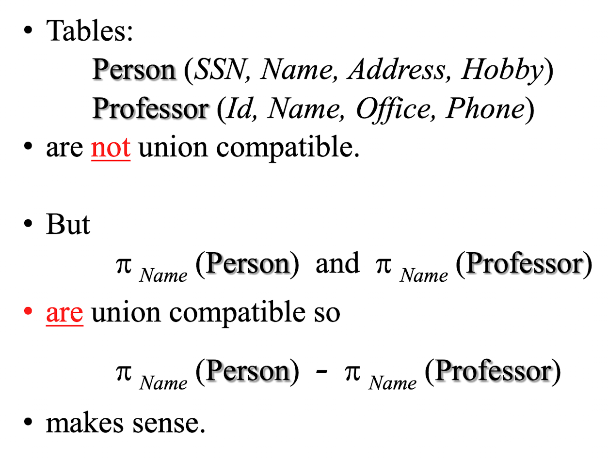

--------

#### • Cartesian Product 
```
If R and S are two relations, R x S is the set of all concantenated tuples <x, y> 
where x is a tuple in R and y is a tuple in S

1) R and S need not be union compatible 
2) but they must have distinct attribute names
|
3) Attributes of relation must have distinct names, which is not guranteed with Cartesian product
```
##### [+] Compute
```
expensive to compute
```

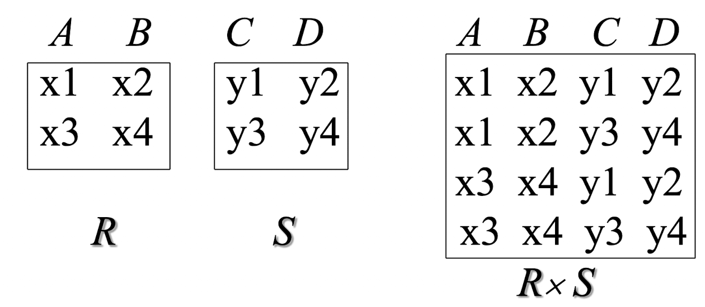

##### [+] Renaming 
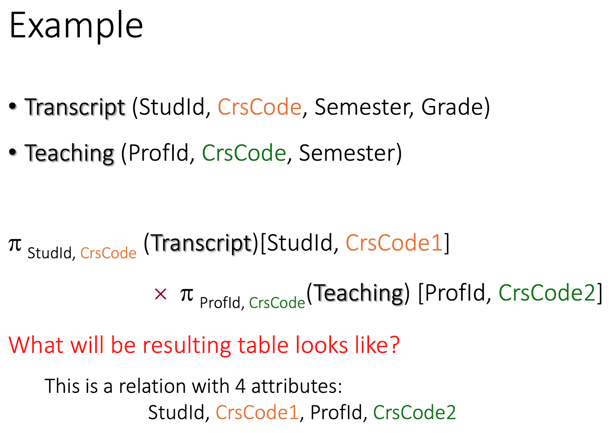

------
#### • Union ( U )

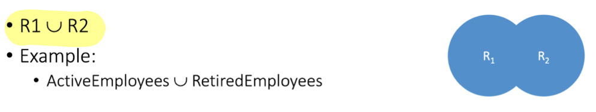

```
Two relations could have common tuples, but no nessarily
```
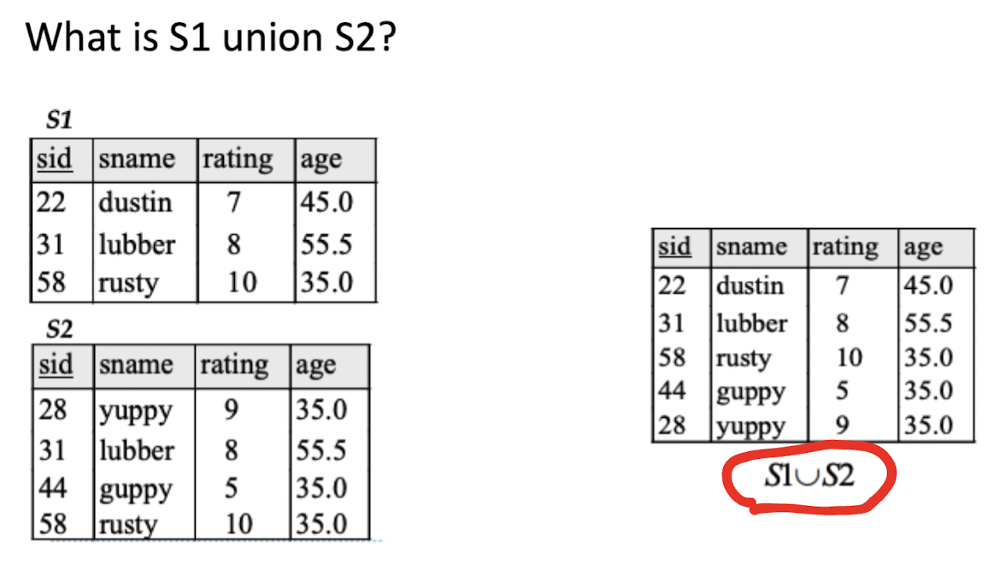

------
#### • Difference ( -- )
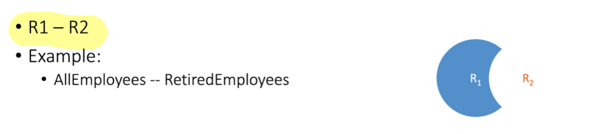

```
deduct the part belongs to R2 from R1, or reserve
```
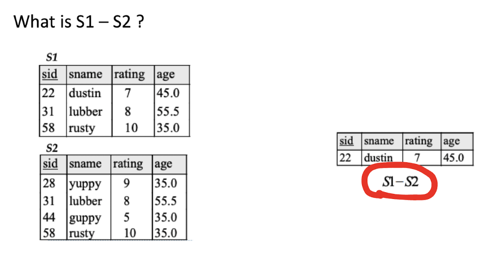

------
#### • Intersection ( &#x2229; )
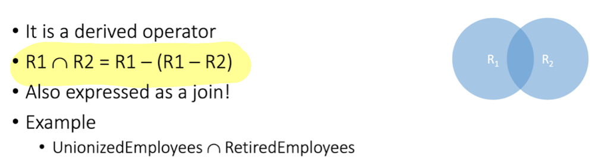

```
the common part both R1 and R2 have
```
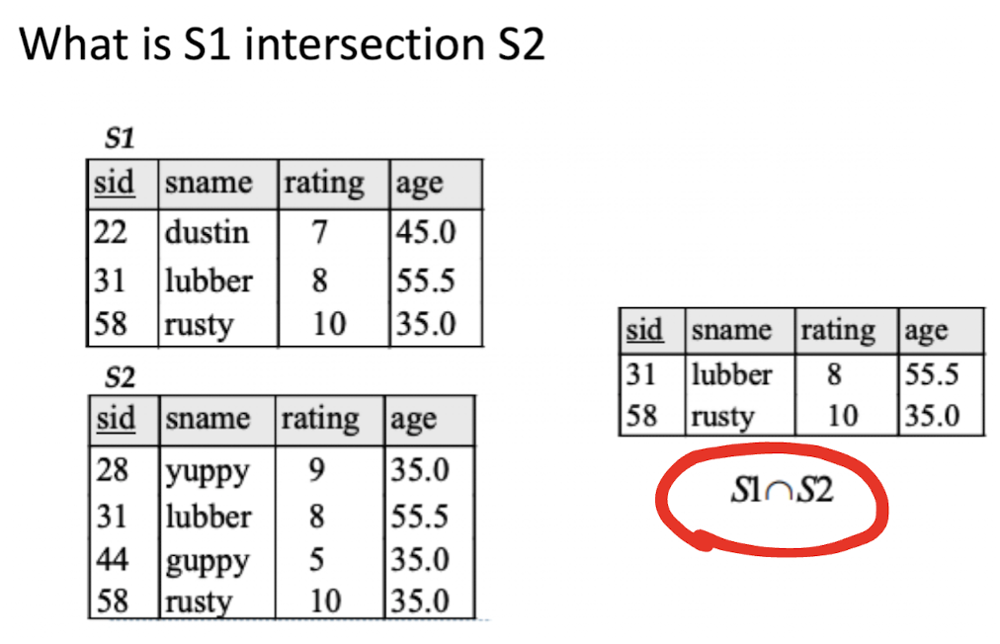

------
#### • Cartesian-Product Operation 
##### [+] Notation: r x s
```
defined as:
r x s = {t q | t ∈ r and q ∈ s}, t, q are rows in r and s 

1) assume that attributes of r(R) and s(S) are disjoint (That is, R ∩ S = ∅)
2) if attributes of r(R) and s(S) are not disjoint, then renaming must be used
```
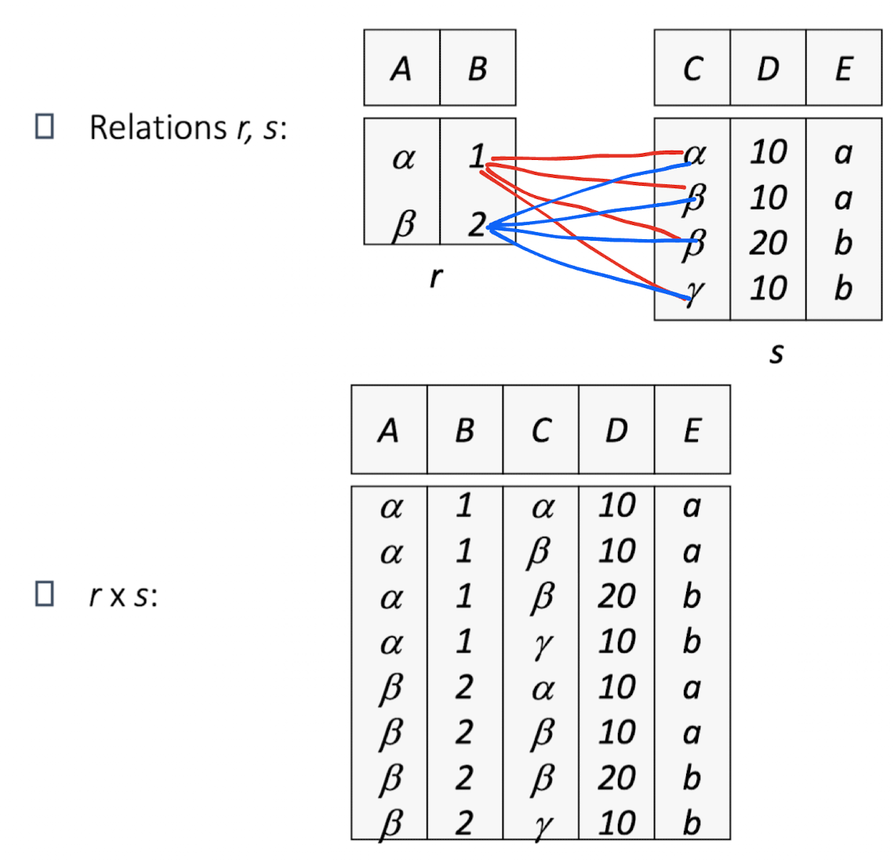

##### [+] **&#x03ec;**<sub>A=C</sub>(r x s)
```
select rows where the value of A = C
```
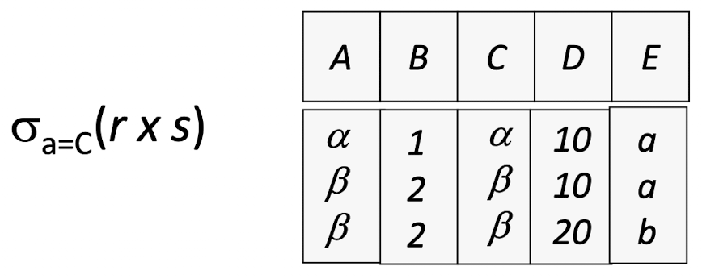

------
#### • Join 
**Catesina Product = "join"**
```
1) theta join:
   + allows for arbitrary comparison relationships (such as >)

2) equijoin 
   + a theta join using the equality operator 

*3) natual join
    + is an equijoin on attributes that have the same name in each relationship 
    + additionally, natrual join removes the duplicate columns 
      involved in the equality comparison so only 1 of each compared column remains
```
##### [+] Natrual Join 
```
R = (a, B, C, D) 
S = (E, B, D)

• Result schema = (a, B, C, D, E)
• r ⋈ s is defined as:
```
**&#x03c0;**<sub>r.a, r.B, r.C, r.D, r.E</sub>(**&#x03ec;**<sub>r.B=s.B ∧ r.D=s.D</sub>(r x s))

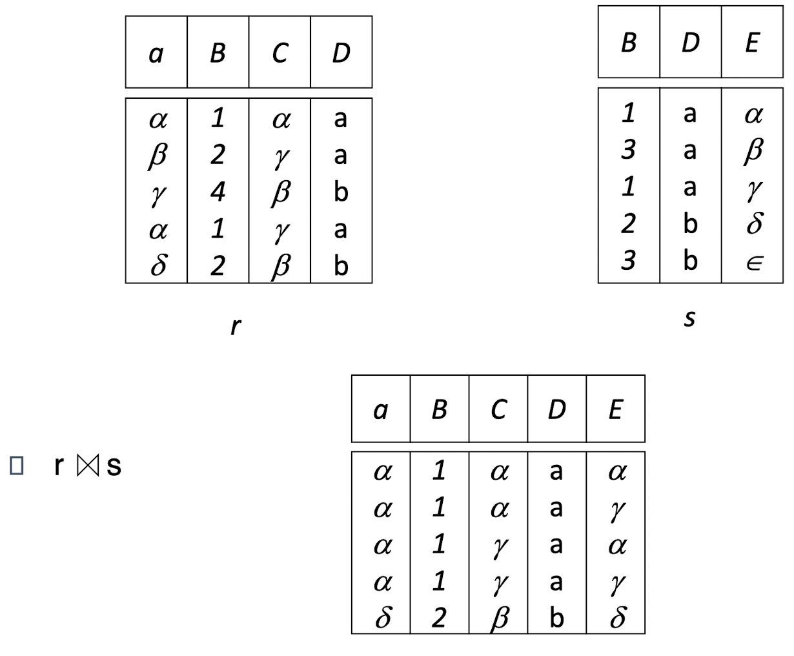

```
1) cross-product (cartesian product) of r and s
2) since both relations have attributes B and C, choose rows where r.B = s.B & r.D = s.D
```

### Exercise 
```
+ Natural Join could combine different attributes into one relations 
+ building connection between all attributes from one table and all attributes from the other table
```
##### [+] solution steps 
```
1) what will be in the result ? 
2) which table give us what from 1) ?
3) conditions ?
4) which table give us the conditions ?
```
-------
#### Sample Query 1 
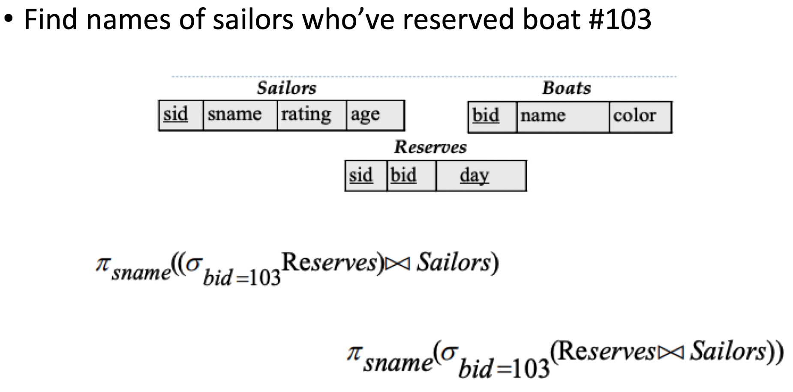

```
1) sname 
2) saliors give sname 
3) bid = #103
4) boats and reserves (the connection we need to build [sname ~ bid])

```

-----
#### Sample Query 2 
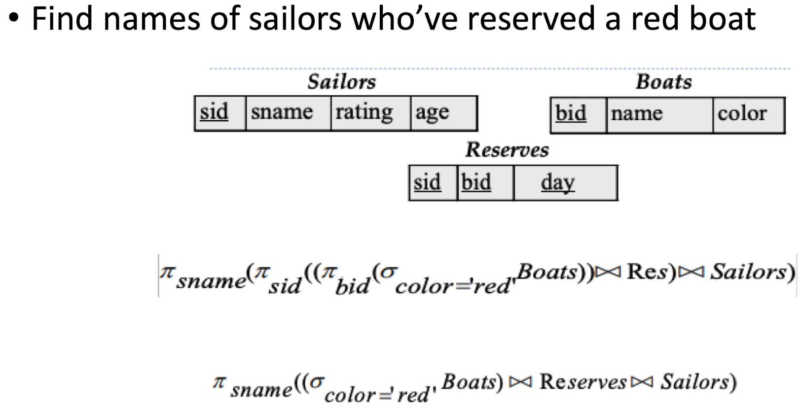

-----
#### Sample Query 3 
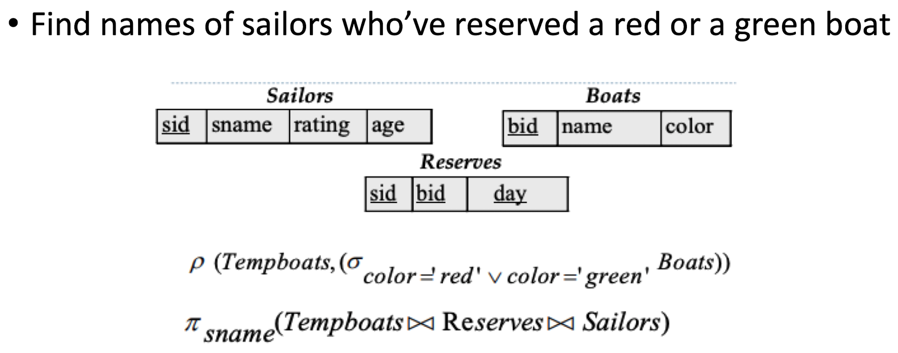

-----
#### Sample Query 4 
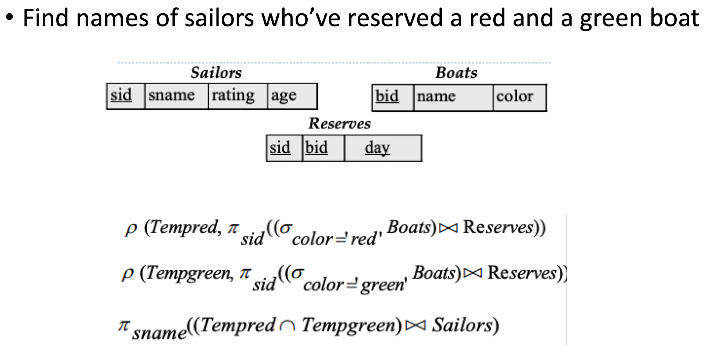

-----
#### Sample Query 5
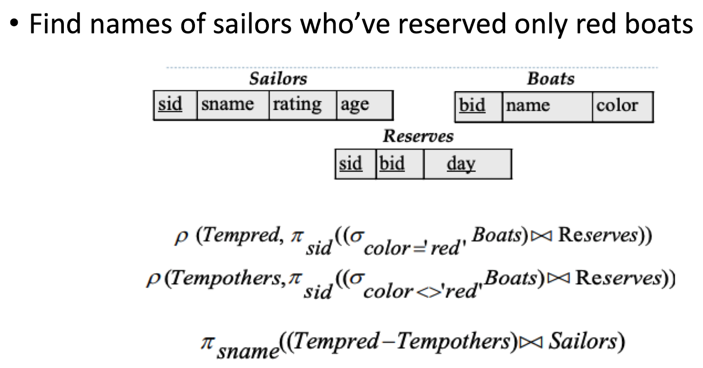

-----
