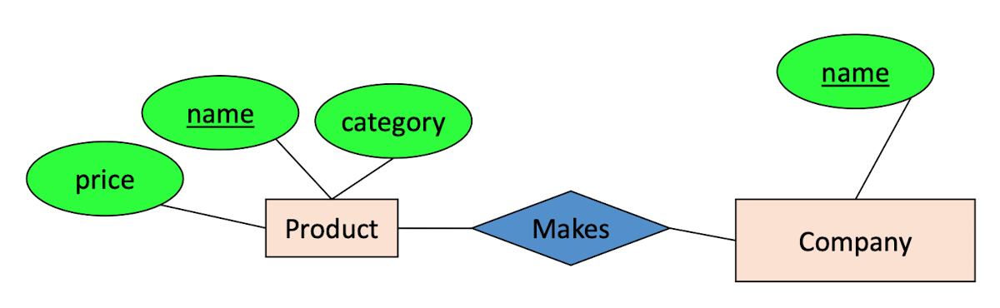
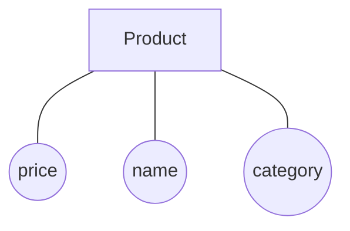

# Entities & Relations 

### Database Design

#### [+] Why do we need it?
```
agree on structure of the database before deciding on a particular implementation 
         -------------------------
```
#### [+] Database Design Process 
##### &#x266f; Requirements analysis 
```
1) What is going to be stored?
2) How is it going to be used?
3) What are we going to do with the data?
4) Who should access the data?
```
##### &#x266f; Conceptual Design 
```
• A high-level description of the database 
    ----------------------
• Suffiently precise that technical people can understand it 
             -------
• but, not so precise that non-technical people can't participate 
       -----------------------------------------------------------
```

##### &#x266f; Logical, Physical, etc

### E/R Basics

<details><summary style=font-size:14px>E/R Model & Diagrams used all three DB design process above</summary>

</details>

```
E/R is a visual syntax for DB design which is precise enough for technical points
but abstract enough for non-technical
```

#### [+] Entities and Entity Sets
```
• Entities & Entity sets are the primitive unit of the E/R model 


1) Entity
individual objects, which are members of entity sets 

    + Product: iPhone, MacBook, iPad, etc
    + person:  Spike, Jet, Faye, Ed, Ein


2) Entity Set (class or types of objects)
    + Perdon, Product 
    + These are what is shown in E/R diagrams - as rectangles
    + Entity sets represent the sets of all possible entities

        ----------         -----------
        | Person |         | Product |
        ----------         -----------
             ^                  ^
             |                  |
        belongs to          belongs to
        /    |    \        /     |    \
    Spike   Jet  ...    iPhone  iPad  MacBook
```
##### &#x266f; attributes 
```
• represented by ovals attached to an entity set (shapes are important, colors are not)
                                                  ------------------------------------
```



