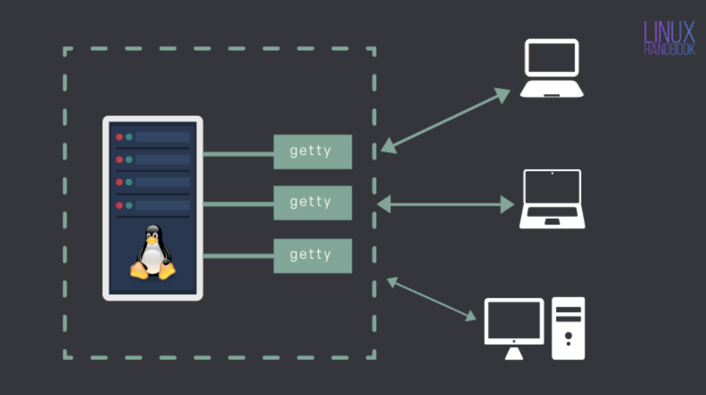
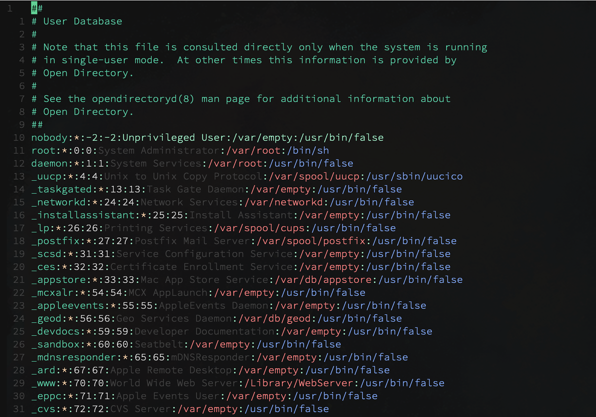
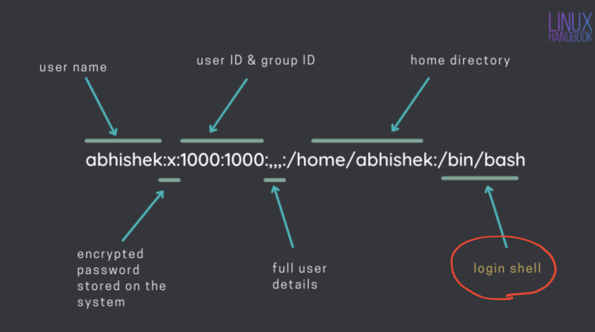

# &#x250f; Shell
```
1) an environment that takes in various commands that can be executed 
2) interpret user-entered comand to operating system


                                        |
                                NINL    |    NIL
                             -----------------------
                                INL     |    IL
                                        |
```
### &#x2317; Types
#### &#x2314; Interactive / Non-Interactive 
```
1) interactive shell (I):
    + expected users to interact with it and will output something 
    + keyboard, written output, etc 

2) non-interactive shell (NI):
    + not expecting for interact 
    + user run something, and doesn't need feeback 
    + usually generate file not output
```
#### &#x2314; Login / Non-Login 
```
1) Login Shell (L)
    + reading certain file once during the startup

2) Non-Login Shell (NL)
    + do not read files that login shell reads
```

### &#x2317; Log into the Server
*[`references`](https://linuxhandbook.com/login-shell/)*
```
from the references: 

1) Linux is a multi-user system where multiple users can log in and use the system at the same time 
2) Login shell is the first process that is executed with your ID when you log into an interactive session
3) the first process in a Linux system is a *getty program*, 
    - which is responsible for protecting from unauthorized access
4) when you connect to a Linux system you have to options 
    a). you have a server installed on a system locally 
    b). via SSH (a server on a remote location)
5) getty prompts you to enter your username. If succeed, then password
```


```
6) getty prompts verify your entries against the information stored in /etc/passwd
7) vim /etc/passwd 
```


```
8)  your entries is verified in the sequence of this
9)  for standard users in Linux, login shell is the first program to start 
10) system user (unlike regular user) login differently
    $ sshd:x:110:65534::/run/sshd:/usr/sbin/nologin
```


#### &#x2314; .zprofile | .zshrc
```
11) bash is usually the default shell for all Linux system 
    + read the login shell file at ~/.bash_profile
    + define own environment variables through non-login shell at ~/.bashrc

12) zsh not seems to be the default for mac 
    + login shell reads ~/.zprofile 
    + define own environment variables at ~/.zshrc
```
#### &#x2314; check which shell it is
```
# type in the command, check output, login shell start with -
>> echo $0

[output]: -zsh # login shell 
[output]: zsh  # non-login shell 
```


### &#x2317; Terminals
*&#x21e2; I found modern terminals seem to have more on top of these categories*
```
In summary: (my assumptions, not verified yet)
----------------------------------------------

1) a macbook has linux system installed locally, and through /etc/passwd I can login to use it 
2) that's why a laptop can also use as host or a server (host & server just large computers)
3) but you can define your own environment variables in ~/.zprofile as well...

4) there are more to know, but it doesn't matter for now if you don't know
```
#### &#x2314; zsh v.s bash
```
Bash (Bourne-Again shell): command-line interpreter for shell scripting
Zsh  (Z shell):            built on top of bash


#! /bin/bash               -- if you want to enforce a script to use bash shell

#! /bin/zsh                -- same for z shell, don't worry if you install zsh through homebrew

# but most of the zsh script is able to run in bash shell, so just put it out
```

#### &#x2314; configure .zprofile
*[`reference`](https://github.com/ChristianChiarulli/Machfiles/blob/master/x/.xprofile)*
```
# startup login shell: 
# --------------------
# .zprofile always has higher priority over .zshrc even in the same directory

# homebrew (setup after installation)
eval "$(/opt/homebrew/bin/brew shellenv)"

# XDG (no idea, but keep it)
export XDG_CONFIG_HOME=/Users/mikiya/.config
export XDG_CACHE_HOME=/Users/mikiya/.cache
export XDG_DATA_HOME=/Users/mikiya/.local/share

# redirect the system to look for .zshrc file in ~/.config/zsh/
export ZDOTDIR=/Users/mikiya/.config/zsh

# one option to remove login info if .hushlogin doesn't work
clear
```

#### &#x2314; scripts 

##### &#x21e2; automate git operation
**[`code`](./scripts/gitPush)**
```shell
# put the file to somewhere easy to locate: like ~/ 
# run it with sh command, solely ./ doesn't seem to work 
# example
>> sh ~/gitPush ComSci *
```

##### &#x21e2; universal scripts 
*`• explain`*
```
1) commands like "ls" are put in the /usr/bin directory. We can use these commands without specifying their path
2) to create commands for our own purpose, we can write scripts and save to somewhere similar
3) just by specifying the path of the commands you saved 
4) actually you can store wherever you want, but for consistent, storing them at the following
```
*`• path`*
```shell
>> sudo mkdir /opt/bin 
>> mv <scripts_you_wrote> /opt/bin

# export the path variable to .zprofile (login shell)
export PATH="/opt/bin:${PATH}"
```


# &#x250f; SSH (Secure Shell)
